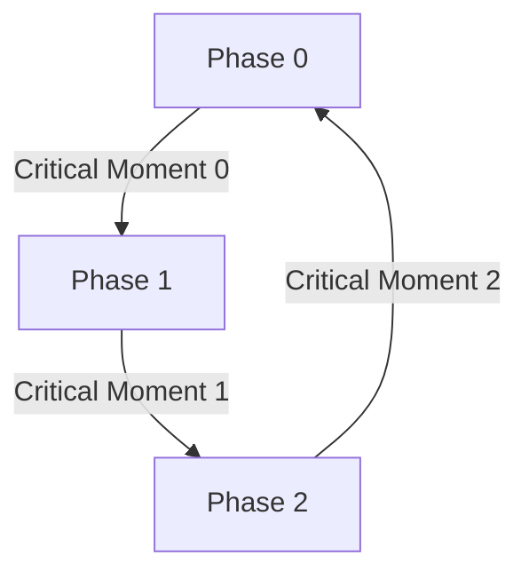

# Preliminary Document

`NOTE:` This page serves as a preliminary document for how the system behave as well
as the devices to be used in the project. None of the below ideas are set in stone,
but simply serve as a reference and guide as we develop the product.

## Mission

Design an affordable, accurate, battery efficient and reliable audible altimeter that
delivers elevation data during a skydive.

## Definitions

Below is a chart describing the terms used in the project and what they mean in the project's context.

| Term | Definition |
| --- | --- |
| Aircraft | The flying device that a `skydiver` will exit from. This can be a hot air balloon, plane, helicopter, commercial jet, paraglider, etc.
| Audible Altimeter | An audible device that reports specific altitude thresholds during a `skydive`. |
| Take Off Zone | The area representing where the `aircraft` will take off from.
| Drop Zone | The area representing where skydivers will land. This is typically the location in which the `altimeters` are synced to for elevation data. `NOTE:` The elevation between the `drop zone` and the `runway` may be different.
| Free Fall | When the skydiver is falling through the sky after jumping out of the `aircraft` and before opening the parachute.
| Skydive | For the purposes of this project, a `skydive` refers to the moment you enter the `aircraft` to landing the parachute on the ground. The stages are: climb to altitude, fall to pull altitude, and parachute flight to the ground. |
| Phase 0 | The period between the `aircraft` leaving the ground and the `skydiver` exiting the `aircraft`.
| Critical Moment 0 | The moment in which the `skydiver` exits the `aircraft` and begins to `free fall`.
| Phase 1 | The period in which the `skydiver` is in `free fall`.
| Critical Moment 1 | The moment in which the `skydiver` deploys the parachute.
| Phase 2 | The period in which the `skydiver` is descending to the ground under a parachute.
| Critical Moment 2 | The moment in which the skydiver lands.

## Companies that Produce Audible Altimeters

| Altimeter | Description | Price |
| --- | --- | -- |
| [VOG](https://vog.ee/) | One of the best audible altimeters on the market. They also have a really good description of their product. | $400 
| [LB Altimeters](https://www.lbaltimeters.com/consumer/solo-ii.html) | A fantastic altimeter. I own this one but from 1998! They are the most reliable and battery efficient altimeters. I use two CR 2330 batteries and they last over a year. | $250 - $300
| [AONN Brilliant Pebbles](https://www.aon2.co.uk/products/brilliant-pebbles-wireless/) | A very cost effective audible altimeter. | $130

## Physical Space Requirements

We have limited real-estate. We should aim for 56x41x11mm. This is standard across almost all altimeters. We <b>might</b>
be able to increase the height, however some skydiving helmets expect these dimensions for an audible.

`Concern:` the amplifier appears to be very close to the height requirement. It sounds like there are
other options to the amplifier. We may want to consider this when designing the case.

## Tools to Use

- [Tiny2350](https://shop.pimoroni.com/products/tiny-2350?variant=42092638699603)
- [BMP390 Temperature & Pressure Sensor](https://www.adafruit.com/product/4816)
- [MAX98357A Amplifier](https://www.adafruit.com/product/3006)
- [Speaker (TBD)](./InitialDesignIdeas.md)
- [Battery (TBD)](./InitialDesignIdeas.md)

## Different Phases of a Jump

### Phase 0 - Aircraft Climbing to Altitude

When the aircraft begins climbing to altitude, this is when we "arm" the device. It will change
from an idle state to more actively checking it's altitude. A skydiver can technically jump out of an aircraft
at any altitude, although typically above 3'000 feet. Emergency exits are possible and can happen starting
around 1'000 feet. Because of this, I think the best way to determine if a skydive has occurred is by
monitoring the fall rate. If we exceed `13 meters per second`, then we can assume the skydive has begun.

- It is a common practice to have audible altimeters make some beeping noise along with a statement
describing we have reached 1'000 feet. This indicates to the jumper that the device is properly calibrated,
and that it is on and working.
- We can consider adding other altitude reports on the way to altitude, however it should be sparse.

For now, the altitudes on the climb up will be:

- `1,000 feet`, `5,000 feet`, `10,000 feet`

### Phase 1 & 2 - The Skydive

The skydive is the most complicated part. There are many factors and use cases to consider. For example:

- Some skydivers have very small parachutes that don't necessarily decrease their fall rate by much.
- Wingsuiters can flare up to if not farther than 1,000 feet vertically.

Due to many edge cases, it might be easier and more reliable to "hard code" a lot of the reported
altitudes. However, there are schematics such as [LB](https://www.aon2.co.uk/products/brilliant-pebbles-wireless/) 
that state 13 meters per second is the speed they use to determine if you are under parachute or
still in free fall. I think following the following how LB determines it will be the most
safe approach.

### Provide two audible modes:

| Skydive Mode | Parachute Mode |
| -- | -- |
| Active when the vertical speed is over `13 meters per second` or `30mph` and we are descending. | Active when the vertical speed is under `13 meters per second` and not at `0` feet (with margin of error) or have not increased or decreased greatly in altitude. |
| The volume will be louder and we will check altitude much more frequently (0.1ms) | The volume will be reduced and we could potentially check altitude less frequently. We will have to consider this in more detail later.

The altitudes reported will be:

- Thousands: `15`, `14`, `13`, `12`, `11`, `10`, `9`, `8`, `7`, `6`, `5.5`, `5`, `4.5`,
`4`, `3.5`, `3`, `2.5`, `2`, `1.5`, `1`,

- Hundreds: `8`, `6`, `5`, `4`, `3`, `2`, `1`,

These will be reported regardless of which mode we are in. The only differences will be the volume
and (potentially) the frequency in which it is checked.

### Critical Moment 2 - Landing

After landing we should greatly reduce the number of times we check the altitude. This will be our idle state
to help reduce power consumption when not needed. I am thinking checking altitude once every `3 seconds` although
this can be fine tuned.
